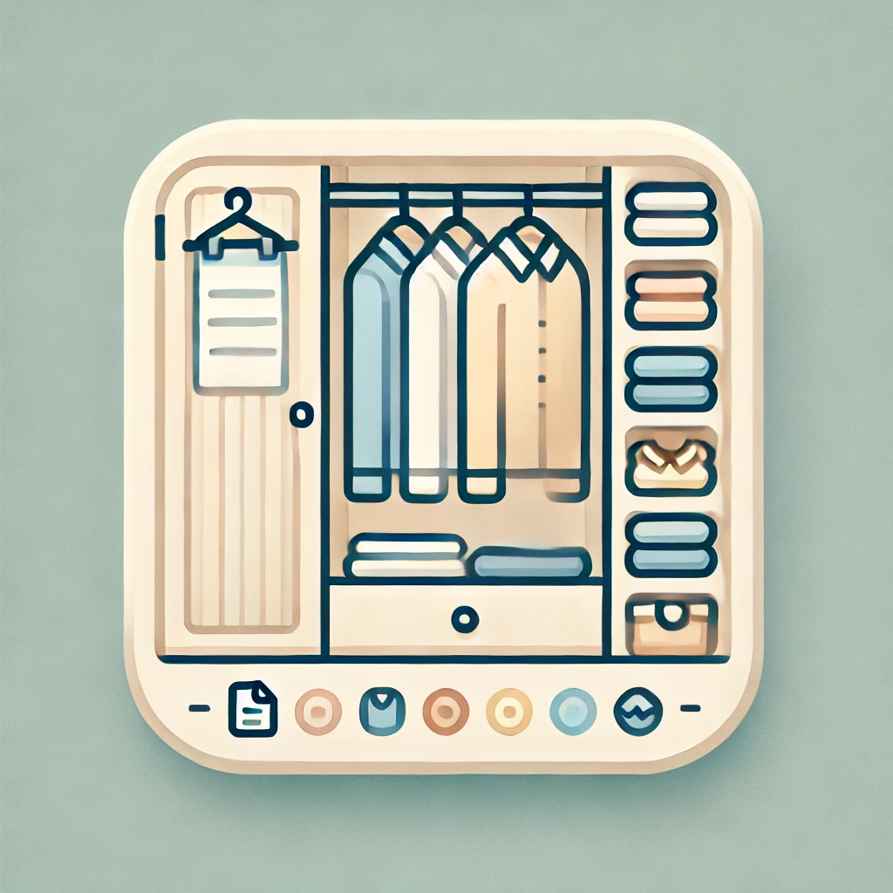

<!-- https://github.com/othneildrew/Best-README-Template -->

[![Contributors][contributors-shield]][contributors-url]
[![Forks][forks-shield]][forks-url]
[![Stargazers][stars-shield]][stars-url]
[![Issues][issues-shield]][issues-url]
[![MIT License][license-shield]][license-url]
[![LinkedIn][linkedin-shield]][linkedin-url]

<!-- PROJECT LOGO -->
 

  

<h3 align="center">WardrobeManager</h3>

  

    Welcome to the world’s first ever all-in-one wardrobe management solution
     
    <a href="https://github.com/m-GDEV/WardrobeManager/tree/master/docs"><strong>Explore the docs »</strong></a>
     
     
    <a href="https://github.com/m-GDEV/WardrobeManager">View Demo</a>
    ·
    <a href="https://github.com/m-GDEV/WardrobeManager/issues/new">Report Bug</a>
    ·
    <a href="https://github.com/m-GDEV/WardrobeManager/issues/new">Request Feature</a>
  

<!-- TABLE OF CONTENTS -->

  
Table of Contents

  <ol>
    <li>
      <a href="#about-the-project">About The Project</a>
      <ul>
        <li><a href="#built-with">Built With</a></li>
      </ul>
    </li>
    <li>
      <a href="#getting-started">Getting Started</a>
      <ul>
        <li><a href="#prerequisites">Prerequisites</a></li>
        <li><a href="#installation">Installation</a></li>
      </ul>
    </li>
    <li><a href="#usage">Usage</a></li>
    <li><a href="#roadmap">Roadmap</a></li>
    <li><a href="#contributing">Contributing</a></li>
    <li><a href="#license">License</a></li>
    <li><a href="#contact">Contact</a></li>
    <li><a href="#acknowledgments">Acknowledgments</a></li>
  </ol>

<!-- ABOUT THE PROJECT -->
## About The Project

(<a href="#readme-top">back to top</a>)

https://github.com/user-attachments/assets/55a1c6b1-d190-4092-a001-c06d387b8cf4

### Built With

* 
* 
* 
* 
* 
* 

(<a href="#readme-top">back to top</a>)

<!-- GETTING STARTED -->
## Getting Started

To be completed! fixlater

(<a href="#readme-top">back to top</a>)

<!-- USAGE EXAMPLES -->

<!--

## Usage

Use this space to show useful examples of how a project can be used. Additional screenshots, code examples and demos work well in this space. You may also link to more resources.

_For more examples, please refer to the [Documentation](https://example.com)_

(<a href="#readme-top">back to top</a>)

-->

<!-- ROADMAP -->
## Roadmap

- [x] Add, view, edit, and delete clothing items
- [x] Login with multiple user accounts
- [x] Customize UI using over 20+ different themes
- [x] Advanced filtering & searching of clothing items
- [ ] Figure out how to sync client & server versions
- [ ] Responsive UI
- [ ] Write tests
- [ ] Ability to deploy application with Docker Compose (update readme)
- [ ] Outfits
  - [ ] Create "outfits", collection of multiple clothing items
  - [ ] Generate outfits dynamically
  - [ ] Group outfits together by colour theme (neutral, vibrant, etc)
  - [ ] Dynamically generate outfits based on color theme (neutral, vibrant, etc)
- [ ] Use native authentication, do not rely on Auth0
- [ ] Generate thumbnails & use them
- [ ] Image processing
  - [ ] Use image processing to detect most common color in image of clothing item
  - [ ] Use image processing to "magically" remove backound of uploaded images
- [ ] Maybe: user management & admin dashboard

See the [open projects](https://github.com/m-GDEV/WardrobeManager/projects) for a full list of proposed features & a more detailed roadmap.

(<a href="#readme-top">back to top</a>)

<!-- CONTRIBUTING -->
## Contributing

Contributions are what make the open source community such an amazing place to learn, inspire, and create. Any contributions you make are **greatly appreciated**.

If you have a suggestion that would make this better, please fork the repo and create a pull request. You can also simply open an issue with the tag "enhancement".
Don't forget to give the project a star! Thanks again!

1. Fork the Project on Github
2. Create your Feature Branch (`git checkout -b feature/AmazingFeature`)
3. Commit your Changes (`git commit -m 'Add some AmazingFeature'`)
4. Push to the Branch (`git push origin feature/AmazingFeature`)
5. Open a Pull Request on Github

(<a href="#readme-top">back to top</a>)

### Top contributors:

<!-- LICENSE -->
## License

Distributed under the GPL 3.0 License. See `LICENSE.txt` for more information.

(<a href="#readme-top">back to top</a>)

<!-- CONTACT -->
## Contact

Musa Ahmed - [musaa.ahmed7@gmail.com](mailto:musaa.ahmed7@gmail.com)

Project Link: [https://github.com/m-GDEV/WardrobeManager](https://github.com/m-GDEV/WardrobeManager)

(<a href="#readme-top">back to top</a>)

<!-- ACKNOWLEDGMENTS -->
## Acknowledgments

* [Best-README-Template: for this cool template](https://github.com/othneildrew/Best-README-Template)
* 
* 

(<a href="#readme-top">back to top</a>)

<!-- MARKDOWN LINKS & IMAGES -->
<!-- https://www.markdownguide.org/basic-syntax/#reference-style-links -->
[contributors-shield]: https://img.shields.io/github/contributors/m-GDEV/WardrobeManager.svg?style=for-the-badge
[contributors-url]: https://github.com/m-GDEV/WardrobeManager/graphs/contributors
[forks-shield]: https://img.shields.io/github/forks/m-GDEV/WardrobeManager.svg?style=for-the-badge
[forks-url]: https://github.com/m-GDEV/WardrobeManager/network/members
[stars-shield]: https://img.shields.io/github/stars/m-GDEV/WardrobeManager.svg?style=for-the-badge
[stars-url]: https://github.com/m-GDEV/WardrobeManager/stargazers
[issues-shield]: https://img.shields.io/github/issues/m-GDEV/WardrobeManager.svg?style=for-the-badge
[issues-url]: https://github.com/m-GDEV/WardrobeManager/issues
[license-shield]: https://img.shields.io/github/license/m-GDEV/WardrobeManager.svg?style=for-the-badge
[license-url]: https://github.com/m-GDEV/WardrobeManager/blob/master/LICENSE.txt
[linkedin-shield]: https://img.shields.io/badge/-LinkedIn-black.svg?style=for-the-badge&logo=linkedin&colorB=555
[linkedin-url]: https://linkedin.com/in/musa_ahmed
[product-screenshot]: docs/demo-video.mp4

