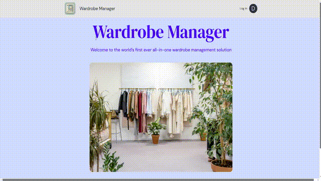

<!-- https://github.com/othneildrew/Best-README-Template -->

[![Contributors][contributors-shield]][contributors-url]
[![Forks][forks-shield]][forks-url]
[![Stargazers][stars-shield]][stars-url]
[![Issues][issues-shield]][issues-url]
[![MIT License][license-shield]][license-url]
[![LinkedIn][linkedin-shield]][linkedin-url]

<!-- PROJECT LOGO -->
<br />
<div align="center">
  <a href="https://github.com/m-GDEV/WardrobeManager">
    
  </a>

<h3 align="center">WardrobeManager</h3>

  <p align="center">
    Welcome to the world’s first ever all-in-one wardrobe management solution
    <br />
    <a href="https://github.com/m-GDEV/WardrobeManager/tree/master/docs"><strong>Explore the docs »</strong></a>
    <br />
    <br />
    <a href="https://github.com/m-GDEV/WardrobeManager">View Demo</a>
    ·
    <a href="https://github.com/m-GDEV/WardrobeManager/issues/new">Report Bug</a>
    ·
    <a href="https://github.com/m-GDEV/WardrobeManager/issues/new">Request Feature</a>
  </p>
</div>


<!-- TABLE OF CONTENTS -->
# Links
* [About The Project](#about-the-project)
* [Built With](#built-with)
* [Installation](#installation)
* [Roadmap](#roadmap)
* [Contributing](#contributing)
  * [Development Environment](#development-environment)
* [License](#license)
* [Contact](#contact)
* [Acknowledgements](#acknowledgements)

<!-- ABOUT THE PROJECT -->
# About The Project

Wardrobe Manager simplifies clothing organization and outfit planning. Add and manage clothing items with images, track wear frequency, and specify preferred combinations. Set wash schedules, mark favorites, and filter by season. This fully open-source application helps optimize wardrobe choices and plan outfits effortlessly. Easily self-hostable, Wardrobe Manager puts you in control of your clothing data and helps you build the perfect look, every time.

<p align="right">(<a href="#readme-top">back to top</a>)</p>



## Built With

* 
* 
* 
* 
* 
* 

<p align="right">(<a href="#readme-top">back to top</a>)</p>


<!-- GETTING STARTED -->
# Getting Started

## Installaion

### Docker

To deploy this application yourself (self-hosted) you can use **docker compose** with an environment file to configure the app.

`docker-compose.yml` (this is likely out of date, check [here](https://github.com/m-GDEV/WardrobeManager/tree/master/docker-compose.yml) for the most up to date version):

```yml
services:
  wardrobe-manager-api:
    image: tmclncy/wardrobemanager-api:latest
    container_name: wardrobe-manager-api
    env_file:
      ./docker/config.env # change this to the right location
    ports:
      - "9000:8080"
    volumes:
      - ./data:/data # you may use a local bind-mount or an actual docker volume

  wardrobe-manager-presentation:
    image: tmclncy/wardrobemanager-presentation:latest
    container_name: wardrobe-manager-presentation
    env_file:
      ./docker/config.env # change this to the right location
    ports:
      - "9001:80"
```

`config.env` (this is likely out of date, check [here](https://github.com/m-GDEV/WardrobeManager/tree/master/docker-compose.yml) for the most up to date version)
```dotenv
# Wardrobe Manager Example Configuration File

# These settings will afffect the API and Presentation

# Url of WardrobeManager.Presentation
WM_FRONTEND_URL=https://localhost:9001

# Url of WardrobeManager.Api
WM_BACKEND_URL=https://localhost:9000

# Maximum image upload size 
WM_MAX_IMAGE_UPLOAD_SIZE_IN_MB=5

# Persistent storage location (do not change if running in docker, change docker volume mount instead)
WM_DATA_DIRECTORY=/data

# Not prefix with 'WM_' as Blazor WASM applications do not have server logs 
# https://learn.microsoft.com/en-us/aspnet/core/fundamentals/logging
# Allowed Levels: Trace, Debug, Information, Warning, Error, Critical, None
Logging__LogLevel__Default=Information
```

**Example setup guide (on UNIX based systems):**
```bash
# Make new directory & go into it:
cd ~
mkdir wardrobe-manager
cd wardrobe-manager

# Download docker-compose.yml:
curl -LO https://raw.githubusercontent.com/m-GDEV/WardrobeManager/master/docker-compose.yml

# Download config.env:
curl -LO https://raw.githubusercontent.com/m-GDEV/WardrobeManager/master/docker/config.env

# Modify docker-compose.yml & config.env as appropriate
vi docker-compose.yml
vi config.env

# Run application with docker compose
docker compose up -d
```


<p align="right">(<a href="#readme-top">back to top</a>)</p>

<!-- ROADMAP -->
# Roadmap

- [x] Add, view, edit, and delete clothing items
- [x] Login with multiple user accounts
- [x] Customize UI using over 20+ different themes
- [x] Advanced filtering & searching of clothing items
- [x] Ability to deploy application with Docker Compose (update readme)
- [x] Use native authentication, do not rely on Auth0
- [ ] Figure out how to sync client & server versions
- [ ] Responsive UI
- [ ] Write tests
- [ ] Outfits
  - [ ] Create "outfits", collection of multiple clothing items
  - [ ] Generate outfits dynamically
  - [ ] Group outfits together by colour theme (neutral, vibrant, etc)
  - [ ] Dynamically generate outfits based on color theme (neutral, vibrant, etc)
- [ ] Generate thumbnails & use them
- [ ] Image processing
  - [ ] Use image processing to detect most common color in image of clothing item
  - [ ] Use image processing to "magically" remove backound of uploaded images
- [ ] Maybe: user management & admin dashboard

See the [open projects](https://github.com/m-GDEV/WardrobeManager/projects) for a full list of proposed features & a more detailed roadmap.

<p align="right">(<a href="#readme-top">back to top</a>)</p>


<!-- CONTRIBUTING -->
# Contributing

## Development Environment

1. Clone the repository: `git clone https://github.com/m-GDEV/WardrobeManager`
2. Open solution in IDE of your choice
3. Run both projects with 'dotnet watch' launch profile
4. Profit

Contributions are what make the open source community such an amazing place to learn, inspire, and create. Any contributions you make are **greatly appreciated**.

If you have a suggestion that would make this better, please fork the repo and create a pull request. You can also simply open an issue with the tag "enhancement".
Don't forget to give the project a star! Thanks again!

1. Fork the Project on Github
2. Create your Feature Branch (`git checkout -b feature/AmazingFeature`)
3. Commit your Changes (`git commit -m 'Add some AmazingFeature'`)
4. Push to the Branch (`git push origin feature/AmazingFeature`)
5. Open a Pull Request on Github

<p align="right">(<a href="#readme-top">back to top</a>)</p>

## Top contributors:

<a href="https://github.com/m-GDEV/WardrobeManager/graphs/contributors">
  
</a>


<!-- LICENSE -->
# License

Distributed under the GPL 3.0 License. See `LICENSE.txt` for more information.

<p align="right">(<a href="#readme-top">back to top</a>)</p>


<!-- CONTACT -->
# Contact

Musa Ahmed - [musaa.ahmed7@gmail.com](mailto:musaa.ahmed7@gmail.com)

Project Link: [https://github.com/m-GDEV/WardrobeManager](https://github.com/m-GDEV/WardrobeManager)

<p align="right">(<a href="#readme-top">back to top</a>)</p>


<!-- ACKNOWLEDGMENTS -->
# Acknowledgments

* [Best-README-Template: for this cool template](https://github.com/othneildrew/Best-README-Template)


<p align="right">(<a href="#readme-top">back to top</a>)</p>


<!-- MARKDOWN LINKS & IMAGES -->
<!-- https://www.markdownguide.org/basic-syntax/#reference-style-links -->
[contributors-shield]: https://img.shields.io/github/contributors/m-GDEV/WardrobeManager.svg?style=for-the-badge
[contributors-url]: https://github.com/m-GDEV/WardrobeManager/graphs/contributors
[forks-shield]: https://img.shields.io/github/forks/m-GDEV/WardrobeManager.svg?style=for-the-badge
[forks-url]: https://github.com/m-GDEV/WardrobeManager/network/members
[stars-shield]: https://img.shields.io/github/stars/m-GDEV/WardrobeManager.svg?style=for-the-badge
[stars-url]: https://github.com/m-GDEV/WardrobeManager/stargazers
[issues-shield]: https://img.shields.io/github/issues/m-GDEV/WardrobeManager.svg?style=for-the-badge
[issues-url]: https://github.com/m-GDEV/WardrobeManager/issues
[license-shield]: https://img.shields.io/github/license/m-GDEV/WardrobeManager.svg?style=for-the-badge
[license-url]: https://github.com/m-GDEV/WardrobeManager/blob/master/LICENSE.txt
[linkedin-shield]: https://img.shields.io/badge/-LinkedIn-black.svg?style=for-the-badge&logo=linkedin&colorB=555
[linkedin-url]: https://linkedin.com/in/musa-ahmed
[product-screenshot]: docs/demo-video.mp4

